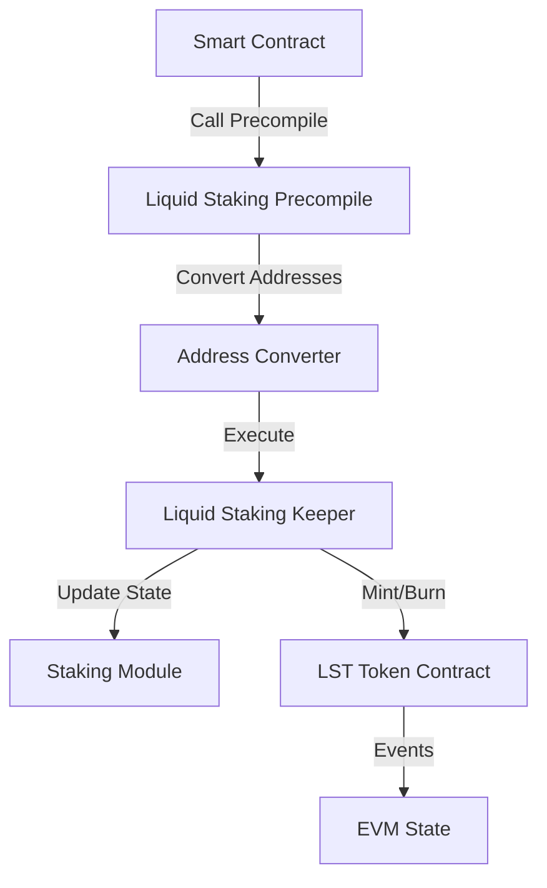

# Liquid Staking Integration Research for Flora

## Overview
This document outlines the research and proposed integration of Cosmos Hub's liquid staking module into Flora blockchain, with a focus on creating EVM precompiles for seamless smart contract interaction.

## Cosmos Liquid Staking Module Analysis

### Core Functionality
The Cosmos liquid staking module (from `cosmos/gaia`) enables:
1. **Tokenization of Staked Shares**: Convert delegations into transferable LST tokens
2. **Redemption**: Convert LST tokens back to native delegations
3. **Transfer Ownership**: Transfer tokenized share records between accounts
4. **Reward Management**: Continue earning staking rewards on tokenized shares
5. **Risk Management**: Global and per-validator liquid staking caps

### Key Message Types
- `MsgTokenizeShares`: Tokenize a delegation
- `MsgRedeemTokensForShares`: Redeem tokens for delegation
- `MsgTransferTokenizeShareRecord`: Transfer ownership
- `MsgDisableTokenizeShares`: Prevent tokenization
- `MsgEnableTokenizeShares`: Re-enable after lock period

## Proposed Flora Integration Architecture

### 1. Module Integration Options

#### Option A: Direct Module Import
- Import liquid staking module from cosmos/gaia
- Adapt for Flora's chain configuration
- Maintain compatibility with existing staking module

#### Option B: Custom Implementation
- Build Flora-specific liquid staking module
- Optimize for EVM integration
- Tailored to Flora's token economics

### 2. EVM Precompile Design

#### Precompile Address Allocation
```
0x0000000000000000000000000000000000000800 - LiquidStaking
0x0000000000000000000000000000000000000801 - LiquidStakingQuery
```

#### Core Precompile Functions

##### LiquidStaking Precompile (0x800)
```solidity
interface ILiquidStaking {
    // Tokenize staked shares
    function tokenizeShares(
        address validator,
        uint256 amount
    ) external returns (uint256 recordId, address lstToken);
    
    // Redeem LST tokens for staked shares
    function redeemTokens(
        uint256 recordId,
        uint256 amount
    ) external returns (bool success);
    
    // Transfer tokenization record ownership
    function transferRecord(
        uint256 recordId,
        address newOwner
    ) external returns (bool success);
    
    // Disable tokenization for sender
    function disableTokenization() external returns (bool success);
    
    // Re-enable tokenization for sender
    function enableTokenization() external returns (bool success);
}
```

##### LiquidStakingQuery Precompile (0x801)
```solidity
interface ILiquidStakingQuery {
    // Get tokenization record details
    function getRecord(uint256 recordId) external view returns (
        address owner,
        address validator,
        uint256 shares,
        address lstToken
    );
    
    // Check if address can tokenize
    function canTokenize(address account) external view returns (bool);
    
    // Get global liquid staking stats
    function getGlobalStats() external view returns (
        uint256 totalLiquidStaked,
        uint256 globalCap,
        uint256 globalCapUsed
    );
    
    // Get validator liquid staking stats
    function getValidatorStats(address validator) external view returns (
        uint256 validatorLiquidStaked,
        uint256 validatorCap,
        uint256 validatorCapUsed
    );
}
```

### 3. LST Token Implementation

#### ERC20-Compatible LST Token
Each validator would have a corresponding LST token:
- Token Name: `Liquid Staked PETAL - {Validator}`
- Symbol: `sPETAL-{ValidatorID}`
- Decimals: 18 (matching PETAL)

#### Token Features
1. **Auto-compounding**: Rewards automatically increase token value
2. **IBC-Enabled**: Can be transferred cross-chain
3. **DeFi Compatible**: Usable in AMMs, lending protocols
4. **Slashing Protection**: Implements slashing event handling

### 4. Technical Implementation Considerations

#### Address Conversion
- Ethereum addresses (20 bytes) ↔ Cosmos addresses (bech32)
- Maintain mapping in state for efficient lookups

#### State Management
```go
type LiquidStakingPrecompileState struct {
    // Record ID to ERC20 token address mapping
    RecordToToken map[uint64]common.Address
    // Ethereum to Cosmos address mapping
    EthToCosmosAddr map[common.Address]sdk.AccAddress
}
```

#### Gas Pricing
- `tokenizeShares`: 100,000 gas
- `redeemTokens`: 80,000 gas
- `transferRecord`: 50,000 gas
- Query functions: 5,000-10,000 gas

### 5. Integration Flow



## Implementation Phases

### Phase 1: Research & Design (Current)
- [x] Analyze Cosmos liquid staking module
- [x] Design precompile interfaces
- [ ] Review security considerations
- [ ] Economic modeling for LST tokens

### Phase 2: Prototype
- [ ] Fork and adapt liquid staking module
- [ ] Implement basic precompile structure
- [ ] Create LST token factory integration
- [ ] Unit tests for core functionality

### Phase 3: Integration
- [ ] Full precompile implementation
- [ ] Cross-module integration tests
- [ ] Gas optimization
- [ ] Security audit preparation

### Phase 4: Testing & Optimization
- [ ] Comprehensive test suite
- [ ] Performance benchmarking
- [ ] Testnet deployment
- [ ] Community testing

## Security Considerations

1. **Reentrancy Protection**: Precompiles must be reentrancy-safe
2. **Slashing Handling**: LST value adjustments on slashing events
3. **Cap Enforcement**: Strict validation of liquid staking limits
4. **Permission Model**: Who can create LST tokens?
5. **Oracle Requirements**: Price feeds for auto-compounding

## Economic Considerations

1. **Fee Structure**:
   - Tokenization fee: 0.1% (configurable)
   - Redemption fee: 0.1% (configurable)
   - Protocol revenue share

2. **Liquidity Incentives**:
   - LP rewards for sPETAL/PETAL pairs
   - Reduced fees for early adopters

3. **Risk Parameters**:
   - Global cap: 25% of total staked PETAL
   - Per-validator cap: 50% of validator's stake
   - Cooldown period: 21 days for redemption

## Integration Challenges & Solutions

### 1. Oracle for Reward Updates

**Challenge**: LST tokens need accurate exchange rates reflecting staking rewards.

**Solutions**:
- **Option A - Hook-based**: Integrate directly with distribution module hooks
  ```go
  // In AfterValidatorModified hook
  updateLSTExchangeRate(validator, newRewards)
  ```
- **Option B - Epoch-based**: Update rates at fixed intervals (e.g., every 100 blocks)
- **Option C - Oracle Network**: Use external oracle for cross-validation

**Recommendation**: Hook-based approach for real-time accuracy.

### 2. Slashing Propagation

**Challenge**: Validator slashing must immediately reduce LST token value.

**Solution**:
```go
// In slashing module's AfterValidatorSlashed hook
func (h Hooks) AfterValidatorSlashed(ctx sdk.Context, valAddr sdk.ValAddress, slashFactor sdk.Dec) {
    // Get LST contract for validator
    lstContract := getLSTContract(valAddr)
    
    // Calculate slashed amount
    slashedAmount := totalPooledPetal.Mul(slashFactor)
    
    // Update LST contract state
    lstKeeper.ApplySlashing(ctx, lstContract, slashedAmount)
}
```

### 3. IBC Compatibility

**Challenge**: Enable cross-chain transfer of LST tokens.

**Solutions**:
- Register LST tokens with IBC transfer module
- Implement custom IBC middleware for exchange rate synchronization
- Use ICS20 standard with metadata extension

### 4. Gas Optimization

**Challenge**: Reduce gas costs for common operations.

**Optimizations**:
- Batch minting/burning in single transaction
- Implement multicall pattern for precompile
- Cache frequently accessed state
- Use packed structs for storage

### 5. Validator Set Changes

**Challenge**: Handle validator leaving active set.

**Solution**:
- Implement forced redemption mechanism
- Allow LST holders to migrate to other validators
- Grace period for voluntary migration

## Advanced Features

### 1. Liquid Governance
- LST holders retain governance rights
- Proxy voting through LST contracts
- Weighted voting based on underlying PETAL

### 2. MEV Protection
- Implement commit-reveal for large stakes
- Rate limiting on tokenization
- Front-running protection via private mempool

### 3. Composability
- LST as collateral in lending protocols
- Integration with DEXs for instant liquidity
- Yield aggregator compatibility

## Testing Strategy

### Unit Tests
```go
func TestLiquidStakingPrecompile(t *testing.T) {
    // Test tokenization
    // Test redemption
    // Test slashing
    // Test reward distribution
}
```

### Integration Tests
- Cross-module interactions
- IBC transfer tests
- Gas consumption benchmarks
- Stress testing with multiple validators

### Security Considerations

1. **Reentrancy**: All state changes before external calls
2. **Integer Overflow**: Use SafeMath operations
3. **Access Control**: Strict permission checks
4. **Rate Limiting**: Prevent spam attacks
5. **Economic Attacks**: Caps and cooldowns

## Deployment Plan

### Phase 1: Testnet Launch (Month 1-2)
- Deploy on Flora testnet
- Limited validator participation
- Community testing program

### Phase 2: Mainnet Beta (Month 3-4)
- Gradual rollout with caps
- Whitelisted validators only
- Insurance fund establishment

### Phase 3: Full Launch (Month 5-6)
- Remove caps gradually
- All validators eligible
- Full DeFi integration

## Performance Metrics

- **Target Gas Cost**: < 150k for tokenization
- **Exchange Rate Updates**: Every block
- **Maximum Validators**: 150 active
- **IBC Transfer Time**: < 30 seconds

## Next Steps

1. **Technical Implementation**:
   - Complete precompile development
   - Implement LST token contracts
   - Build oracle infrastructure

2. **Testing & Audits**:
   - Internal security review
   - External audit engagement
   - Bug bounty program

3. **Community Engagement**:
   - Validator onboarding program
   - Developer documentation
   - User education campaign

4. **Ecosystem Development**:
   - Partner with DeFi protocols
   - Build liquidity incentives
   - Create developer grants

## References

- [Cosmos Liquid Staking Module](https://github.com/cosmos/gaia/tree/main/x/liquid)
- [EVM Precompiles in Evmos](https://docs.evmos.org/develop/smart-contracts/evm-extensions/precompiles)
- [Stride Protocol](https://github.com/Stride-Labs/stride)
- [Liquid Staking Research](https://research.paradigm.xyz/liquid-staking)
- [Ethereum Staking Derivatives](https://ethereum.org/en/staking/pools/)