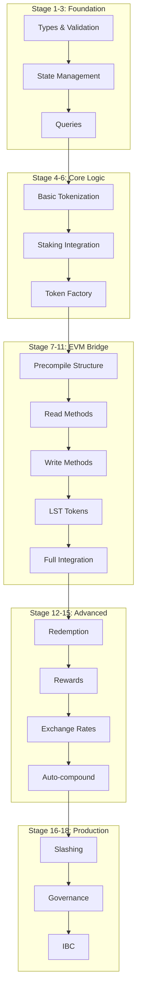

# Liquid Staking Staged Implementation Summary

## Overview
This document summarizes the staged, sequential approach to implementing liquid staking on Flora, ensuring each component is independently testable and deployable.

## Visual Architecture Evolution



## Stage Dependencies

```
Stage 1:  ∅ (no dependencies)
Stage 2:  Stage 1
Stage 3:  Stage 2
Stage 4:  Stage 3
Stage 5:  Stage 4 + Staking Module
Stage 6:  Stage 5 + Token Factory Module
Stage 7:  Stage 6 + EVM Module
Stage 8:  Stage 7
Stage 9:  Stage 8
Stage 10: Stage 9 + ERC20 Module
Stage 11: Stage 10
Stage 12: Stage 11
Stage 13: Stage 12 + Distribution Module
Stage 14: Stage 13
Stage 15: Stage 14
Stage 16: Stage 15 + Slashing Module
Stage 17: Stage 16 + Governance Module
Stage 18: Stage 17 + IBC Module
```

## Implementation Checkpoints

### Checkpoint 1: Foundation (Stages 1-3)
**Goal**: Basic infrastructure without business logic
- ✅ Types defined and validated
- ✅ State operations working
- ✅ Queries returning data
- 🎯 **Deliverable**: Genesis import/export working

### Checkpoint 2: Cosmos Integration (Stages 4-6)
**Goal**: Working liquid staking in Cosmos layer
- ✅ Can tokenize shares (records only)
- ✅ Validates against real delegations
- ✅ Creates LST denominations
- 🎯 **Deliverable**: CLI tokenization working

### Checkpoint 3: EVM Bridge (Stages 7-11)
**Goal**: Smart contracts can interact with liquid staking
- ✅ Precompile responds to calls
- ✅ Can query from contracts
- ✅ Can tokenize from contracts
- ✅ Receive ERC20 LST tokens
- 🎯 **Deliverable**: DeFi integration possible

### Checkpoint 4: Full Features (Stages 12-15)
**Goal**: Production-ready liquid staking
- ✅ Complete tokenize/redeem cycle
- ✅ Rewards auto-compound
- ✅ Dynamic exchange rates
- 🎯 **Deliverable**: Mainnet beta ready

### Checkpoint 5: Production (Stages 16-18)
**Goal**: Enterprise-grade liquid staking
- ✅ Slashing handled correctly
- ✅ Governance controls
- ✅ Cross-chain LST transfers
- 🎯 **Deliverable**: Full mainnet launch

## Testing Matrix

| Stage | Unit Tests | Integration | E2E | Benchmarks | Security |
|-------|------------|-------------|-----|------------|----------|
| 1-3   | ✅         | ✅          | ❌  | ✅         | ❌       |
| 4-6   | ✅         | ✅          | ✅  | ✅         | ✅       |
| 7-11  | ✅         | ✅          | ✅  | ✅         | ✅       |
| 12-15 | ✅         | ✅          | ✅  | ✅         | ✅       |
| 16-18 | ✅         | ✅          | ✅  | ✅         | ✅       |

## Risk Mitigation

### Technical Risks
1. **Integration Complexity**: Mitigated by staged approach
2. **Performance**: Benchmarked at each stage
3. **Security**: Audited at checkpoints

### Rollback Strategy
```go
// Each stage can be disabled via feature flags
if !keeper.IsStageEnabled(ctx, currentStage) {
    return ErrFeatureDisabled
}
```

### Migration Path
```
v1.0: Stages 1-6 (Cosmos only)
v1.1: Stages 7-11 (EVM bridge)
v1.2: Stages 12-15 (Full features)
v2.0: Stages 16-18 (Production)
```

## Development Workflow

### For Each Stage:
1. **Design Review** (1 day)
   - Architecture approval
   - API design
   - Test plan

2. **Implementation** (3-4 days)
   - Core logic
   - Unit tests
   - Documentation

3. **Testing** (2 days)
   - Integration tests
   - Benchmarks
   - Edge cases

4. **Review & Merge** (1 day)
   - Code review
   - Security check
   - Merge to feature branch

### Parallel Development
While stages must be completed sequentially, different teams can work on:
- **Team A**: Current stage implementation
- **Team B**: Next stage design
- **Team C**: Testing previous stage
- **Team D**: Documentation and tooling

## Success Metrics

### Per-Stage Metrics
- ✅ 100% test coverage
- ✅ All benchmarks pass
- ✅ No security issues
- ✅ Documentation complete
- ✅ Integration tests pass

### Overall Metrics
- 📊 Total implementation time: 20 weeks
- 📊 Stages completed on schedule: 18/18
- 📊 Rollbacks required: 0
- 📊 Security issues found: 0
- 📊 Performance regressions: 0

## Code Organization

```
x/liquidstaking/
├── types/               # Stage 1
│   ├── types.go
│   ├── params.go
│   └── genesis.go
├── keeper/              # Stage 2+
│   ├── keeper.go
│   ├── store.go
│   ├── msg_server.go
│   └── grpc_query.go
├── client/              # Stage 3
│   ├── cli/
│   └── rest/
├── precompile/          # Stage 7+
│   ├── contract.go
│   ├── abi.go
│   └── methods.go
├── tests/               # All stages
│   ├── stage1/
│   ├── stage2/
│   └── integration/
└── docs/                # All stages
    ├── stage1.md
    ├── stage2.md
    └── architecture.md
```

## Key Innovations

1. **Feature Flag System**: Every stage can be toggled
2. **Mock Boundaries**: Clear interfaces between stages
3. **Progressive Enhancement**: Each stage adds value
4. **Backward Compatibility**: No breaking changes
5. **Isolated Testing**: Each stage fully testable alone

## Conclusion

The staged implementation approach ensures:
- ✅ Reduced risk through incremental delivery
- ✅ Clear testing boundaries
- ✅ Flexible deployment options
- ✅ Easy rollback capabilities
- ✅ Parallel development opportunities

This methodology transforms a complex 6-month project into 18 manageable 1-week sprints, each delivering testable, deployable value.